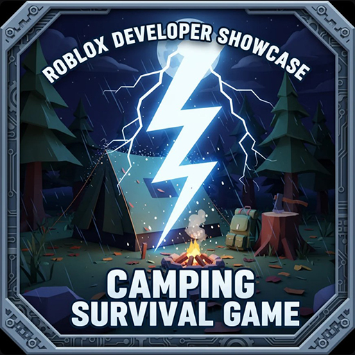
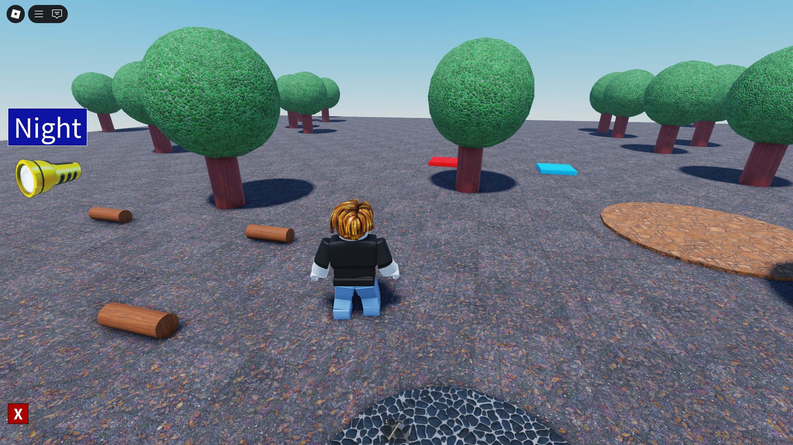
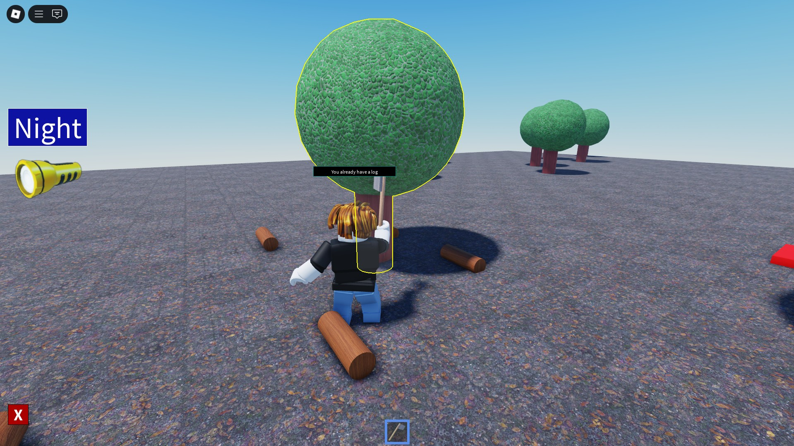
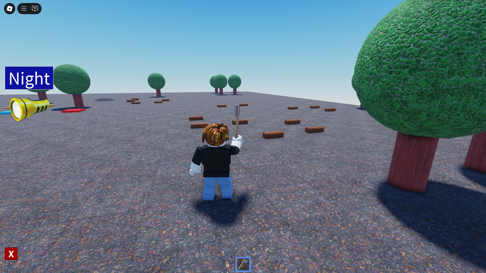
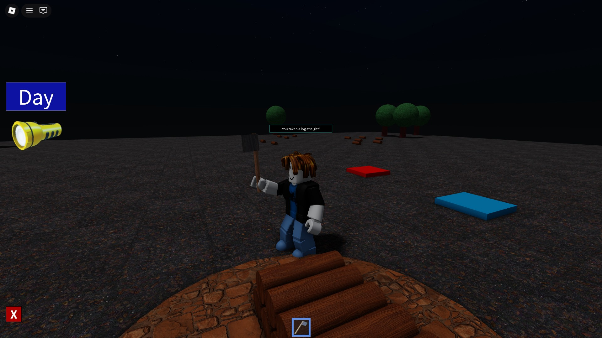
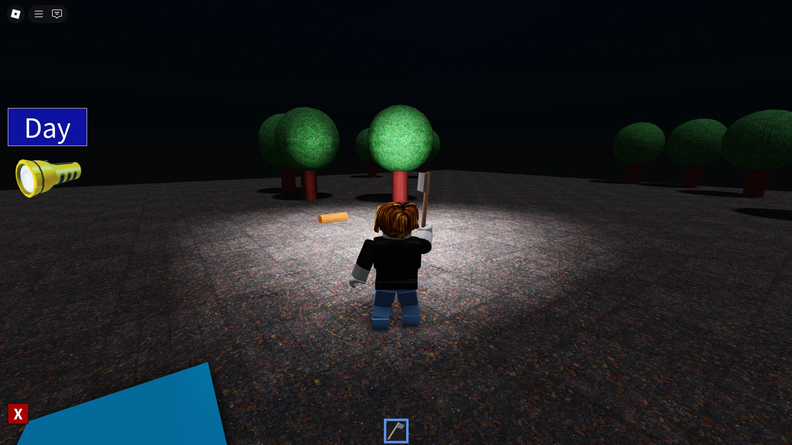
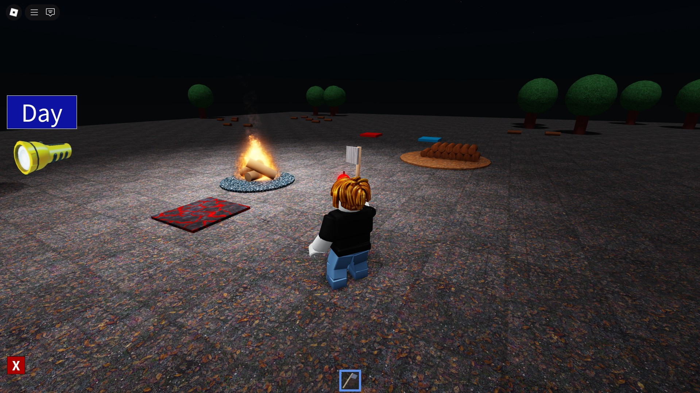

# 🏕️ Roblox Developer Showcase - Camping Survival Game

This project is a camping survival game prototype I built over a weekend as my first foray into the Roblox platform. While I have 6 years of experience developing games with Unity, this was a new and exciting challenge.

The game was developed by following the [**Camping Survival Game**](https://www.udemy.com/course/robloxadvancedcodingcourse/) course on Udemy.

This project showcases my ability to quickly adapt to new platforms, learn independently, and apply new skills in a practical setting.

## 🎮 Play the Game

You can try the prototype here: [**Play on Roblox**](https://www.roblox.com/vi/games/125940314543671/Roblox-Developer-Showcase-Camping-Survival-Game)

## ✨ Features

Based on the course curriculum, here is the current progress of the game's features.

### Implemented Features
- [x] **Environment & Basic Setup**: Set up the game world and initial environment.
- [x] **Resource Gathering System**:
    - Implemented log pickup and a central woodpile system (add/take).
    - Created the axe tool with animations for chopping trees.
    - Implemented tree spawning, finding the nearest tree, and spawning logs after chopping.
- [x] **Campfire Mechanics**: Players can add logs to the fire.
- [x] **Core Player Systems**: Developed a utility module for player messages.

### In Progress / Planned Features
- [ ] **Advanced Survival Mechanics**:
    - Player survival clock, hunger, and damage system.
    - Food gathering (collecting/eating apples).
- [ ] **Enemy AI**:
    - Create rat enemies with AI (patrolling, eating, attacking players).
    - AI behavior variations (night-only attacks, safe zones).
- [ ] **Advanced Gameplay Loop**:
    - Player lives, respawning, and stats system.
    - Day/night cycle with increased difficulty.
    - Environmental hazards (e.g., lava).
- [ ] **Data Persistence**: Save player data using DataStores.
- [ ] **Game Balancing & Polishing**.

## 🚀 Learning Journey

Transitioning from Unity to Roblox introduced many new concepts. I documented my learning process, focusing on active research and experimentation to understand a wide range of topics, including:

-   **Core Lua & Roblox Concepts:**
    -   Procedural scripting and game logic in Luau.
    -   The difference between `:` and `.` syntax.
    -   Understanding `ReplicatedStorage`, `ServerScriptService`, and `ServerStorage`.
    -   The architecture of Roblox: C++ (Layer 0) and Luau (Layer 1).
    -   Proper use of `ModuleScript` for code organization.
    -   Variable scope (local vs. global) and best practices for global variables.
    -   Reliable service access with `:GetService()`.
    -   The distinction between `WaitForChild()` and direct indexing.

-   **Game Development Patterns & Optimization:**
    -   Object-Oriented Programming (OOP) with Lua.
    -   Design Patterns in Lua.
    -   Game Algorithms and logic.
    -   Using `Debris` service for optimized object destruction.
    -   Implementing an `Object Pool` for performance.
    -   Debounce techniques for tool activation and event handling.
    -   Comparing `Attributes` vs. `ModuleScripts` for data storage.
    -   Storing data in tables (`TableData Storage`).

-   **Unity to Roblox Transition:**
    -   Creating prefabs in Roblox, similar to Unity.
    -   Understanding `Position` and `AnchorPoint` for UI and object placement.
    -   Implementing health scripts in `StarterCharacterScripts`.

-   **Development Workflow & Tooling:**
    -   Using Rojo for VSCode integration.
    -   Managing packages with Wally.
    -   Integrating GitHub Copilot directly into the Roblox workflow.

## 🖼️ Screenshots

|   |   |
|---|---|
|  |  |
|  |  |
|  |  |

